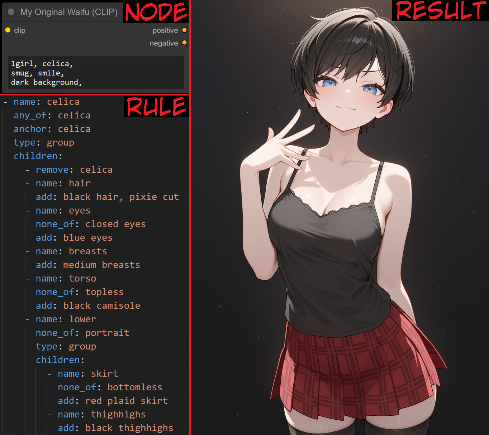
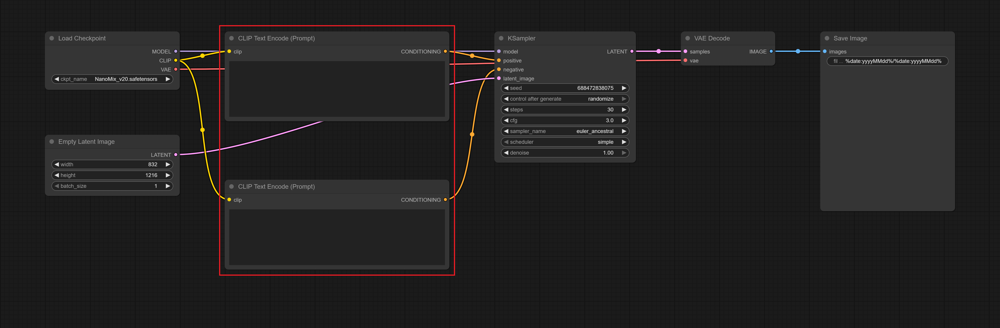
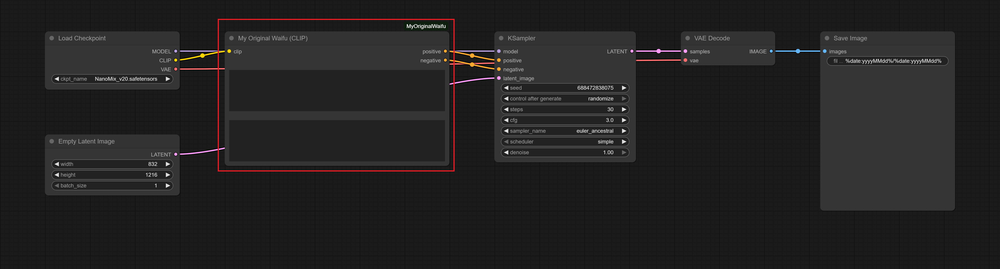
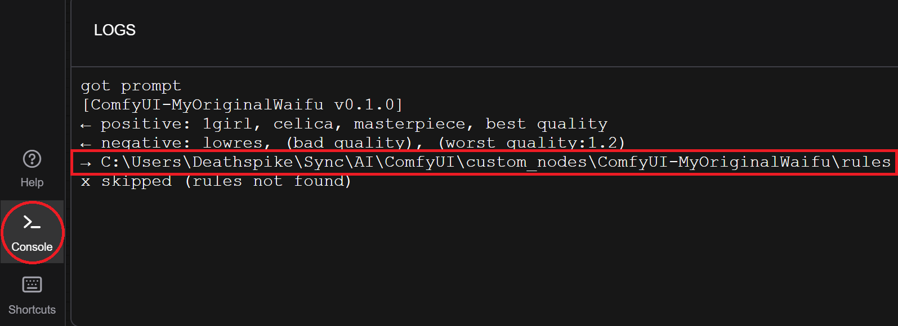

# 🌸 My Original Waifu

_My Original Waifu_ is a **tag-based prompt-transformation engine** for ComfyUI designed for creators who want their original characters to feel consistent, expressive, and faithfully rendered across every scene. Instead of manually adjusting tags each time you generate an image, you define the essence of your _waifu_, her look, her outfits, the way she appears in different contexts, and the engine transforms your prompt to match those intentions. It stays out of the way and simply **follows your rules with clarity and consistency**. _Your Waifu. Your Rules. Your Perfect Prompt._

## 🤨 What the hell does that-

<p align="center">
  
</p>

## 💡 Ohh! But **why**?

Because prompting for your _waifu_ is:

- **Repetitive**: the same eyes, hair, and details _every_ single time.
- **Contextual**: what she wears or how she appears _depends_ on the scene.
- **Conditional**: _some_ tags only make sense from certain angles or in certain shots.
- **Cumbersome**: remembering every rule, exception, and detail is _exhausting_.
- **Verbose**: prompts grow into _huge_ walls of text just to express simple intentions.

_My Original Waifu_ can help by **automating your prompt**:

- It can keep _appearances stable_ by enforcing the traits you define.
- It can _add details_ at the right time based on angle, context, and conditions you describe.
- It can help avoid impossible combinations by _removing details_ that don't make sense.
- It can let your prompt stay _short_, even when the logic behind it is _huge_.

All of this happens through **simple, declarative YAML** rules that _you_ control.

## 📜 What? Declarative YAML?

Yes! Think of YAML as a way to write down information in a format that's _easy for humans to read and write_, and _easy for computers to understand_. You can imagine your YAML rule file as your **character sheet**, or the **secret sauce** behind your _waifu_! And _declarative_ just means: _you're describing what your waifu is like and when her traits should show_. Look at these examples:

```yaml
- any_of: celica
  add: black hair, pixie cut
```

> _"If the positive prompt **contains** `celica`, **add** `black hair` and `pixie cut`."_

```yaml
- any_of: celica
  none_of: closed eyes
  add: blue eyes
```

> _"If the positive prompt **contains** `celica`, and **does not contain** `closed eyes`, **add** `blue eyes`._"

That's the whole idea: you declare the logic _once_, and the engine automates your prompt _forever_.

## 🛠️ Okay! How do I install this thing?

Good question! Installing _My Original Waifu_ is quicker than picking your _waifu's_ hairstyle. You can install in two ways:

### Option 1 - ComfyUI Manager (Recommended)

1. Open **ComfyUI Manager**.
2. Go to **Custom Nodes Manager**.
3. Search for **MyOriginalWaifu** by **Deathspike**.
4. Click **Install** and choose **latest**.
5. Restart ComfyUI.

### Option 2 - Manual Installation

1. Open **Command Prompt** (_Windows_) or **Terminal** (_macOS/Linux_).
2. Navigate to your **custom_nodes** directory: `cd /path/to/comfyui/custom_nodes`
3. **Clone** this repository: `git clone https://github.com/Deathspike/ComfyUI-MyOriginalWaifu`
4. Restart ComfyUI.

## 🚀 Right! What's next?

Just swap your **CLIP Text Encode (Prompt)** nodes with **My Original Waifu (CLIP)**. Here's a basic workflow:

<p align="center">
  
</p>

And here's the _exact same_ workflow after **swapping the CLIP nodes**:

<p align="center">
  
</p>

**Run the workflow** and open your **console**. You'll see _My Original Waifu_ attempting to load YAML rule files:

<p align="center">
  
</p>

> [!TIP]
> You can [**download this example**](docs/workflows/MyOriginalWaifuCLIP.json). It uses my [**NanoMix v2.0**](https://civitai.com/models/932505?modelVersionId=2060158) model, but you can use **any model** you like.

## 💗 Teach me, Senpai!

I'm glad you're so _enthusiastic_! Let's turn you into a **rule-writing master**.

> [!WARNING]
> Until **v1.0**, syntax and semantics _may_ change. I'll do my best to keep updates backwards-compatible.

### 1. YAML Rule File

All your _waifu_ logic lives in **YAML rule files** inside the extension's `rules` directory:

```text
ComfyUI/
  custom_nodes/
    ComfyUI-MyOriginalWaifu/
      rules/
        ...
```

> [!TIP]
> If you don't know the path, **run the workflow** and copy the `rules` directory path from your console.

You can create a file per _waifu_, per _outfit_, or mix them. **It's up to you**. Just make sure the file extension is `.yaml`.

> [!NOTE]
> You **do not have to restart** ComfyUI. _My Original Waifu_ automatically reloads YAML rule files.

I _strongly_ recommend using **VSCodium**, or any editor with YAML syntax highlighting.

### 2. Rule List

A YAML rule file is just a **list of rules**, evaluated in order, from top to bottom:

```yaml
- add: black hair, pixie cut
- add: blue eyes
```

Each **rule is independent**, but together they build your _waifu_.

### 3. Tag Rules: `add`, `add_negative`, `remove`, `remove_negative`

The default _type of rule_ is the _tag_ rule, and these decide **what tags are added or removed**.

#### `add`

**Adds** tags to the **positive prompt**:

```yaml
- add: black hair, pixie cut
```

> _"Always **add** `black hair` and `pixie cut` to the **positive prompt**."_

#### `add_negative`

**Adds** tags to the **negative prompt**:

```yaml
- add_negative: blue hair
```

> _"Always **add** `blue hair` to the **negative prompt**."_

#### `remove`

**Removes** tags from the **positive prompt** (if they exist).

```yaml
- remove: celica
```

> _"Always **remove** `celica` from the **positive prompt**."_

#### `remove_negative`

**Removes** tags from the **negative prompt** (if they exist).

```yaml
- remove_negative: sketch
```

> _"Always **remove** `sketch` from the **negative prompt**._"

---

> [!IMPORTANT]
> Removed tags **remain visible** for _future rules_, but **will not be in the output prompt**.

> [!TIP]
> You should **remove your _waifu's_ name**. The model doesn't know it anyway,
and might even _misinterpret_ it.

### 4. Conditions: `any_of`, `all_of`, `none_of`

Conditions can be added to _any type of rule_, and these decide **if the rule is evaluated**.

#### `any_of`

Requires that **at least one of the tags is present** in the **positive prompt**:

```yaml
- any_of: celica, charlotte
  add: blue eyes
```

> _"If the positive prompt **contains** `celica` **or** `charlotte`, **add** `blue eyes`._"

#### `all_of`

Requires that **all the tags are present** in the **positive prompt**:

```yaml
- all_of: celica, jacket
  add: black leather jacket
```

> _"If the positive prompt **contains** `celica` **and** `jacket`, **add** `black leather jacket`._"

#### `none_of`

Requires that **none of the tags are present** in the **positive prompt**:

```yaml
- none_of: closed eyes, eyes out of frame
  add: blue eyes
```

> _"If the positive prompt **contains neither** `closed eyes` **nor** `eyes out of frame`, **add** `blue eyes`._"

#### Combinations

All combinations of `any_of`, `all_of` and `none_of` are valid:

```yaml
- any_of: celica
  none_of: closed eyes
  add: blue eyes
```

> _"If the positive prompt **contains** `celica`, and **does not contains** `closed eyes`, **add** `blue eyes`._"

---

> [!IMPORTANT]
> Conditions _intentionally_ **see only the positive prompt**. Writing rules as "_if X contains Y, do Z_" keeps them simple.

### 5. Anchors: `anchor`, `anchor_negative`

Anchors can be added to _any type of rule_, and decide **where tags are added**.

#### `anchor`

Sets the _positive anchor_ to the **first matched** tag in the **positive prompt**:

```yaml
- anchor: celica, charlotte
  add: blue eyes
```

> _"Always **add** `blue eyes` to the **positive prompt**, **right after** `celica` or `charlotte`."_

#### `anchor_negative`

Sets the _negative anchor_ to the **first matched** tag in the **negative prompt**:

```yaml
- anchor_negative: sketch
  add_negative: poorly drawn
```

> _"Always **add** `poorly drawn` to the **negative prompt**, **right after** `sketch`."_

---

> [!IMPORTANT]
> If an **anchor is not found**, the anchor will _not_ change. Without one, tags are added to the **end of the prompt**.

### 6. Group Rules

Groups let you bundle **multiple rules** under **the same _conditions_ and _anchors_**. Use `type: group` **and** `children`:

```yaml
- any_of: celica
  anchor: celica
  type: group
  children:
    - remove: celica
      add: black hair, pixie cut
    - none_of: closed eyes, eyes out of frame
      add: blue eyes
```

> _"If the positive prompt **contains** `celica`, **evaluate all child rules**, and **add** their tags **right after `celica`**."_

These are the _key points_:

- The group rule's _conditions_ **must match**, otherwise child rules **are not** evaluated.
- The group rule's _anchors_ set the _starting anchor_ for **all** child rules.
- Child rules are evaluated in order, from top to bottom.
- Child rules can have their own _conditions_ and _anchors_.
- Child rules can themselves be _group_ or _switch_ rules.

Groups are _perfect_ to keep related rules together, and help you **avoid repeating** the same _conditions_ and _anchors_.

### 7. Switch Rules

Switches let you **choose a child** that matches _conditions_, or use the **default child**. Use `type: switch` and `children`:

```yaml
- any_of: celica
  anchor: celica
  type: switch
  children:
    - any_of: jacket
      add: black leather jacket
    - any_of: shirt
      add: black t-shirt
    - default: true
      add: black camisole
```

> _"If the positive prompt **contains** `celica`, **evaluate the first matching** child, and **add** its tags **right after `celica`**."_

These are the _key points_:

- The switch rule's _conditions_ **must match**, otherwise child rules **are not** checked.
- The switch rule's _anchors_ set the _starting anchor_ for the **chosen** child rule.
- Non-_default_ child rules **must** have at least one _condition_, and _may_ have an anchor.
- Non-_default_ child rules are checked in order, from top to bottom, and the **first match** is chosen.
- One child rule _may_ be **set as default** with `default: true`, and it **must not** have _conditions_.
- Child rules can themselves be _group_ or _switch_ rules.

Switches are _perfect_ when you want **mutually exclusive options**, like picking an outfit.

## 😭 Help, my _waifu_ is broken!

That happens to _the best of us_! _My Original Waifu_ always tells you **what it did**, and more importantly, **why it did** that.

### Errors

If a YAML rule file **contains invalid rules**, the engine will refuse to run and **shows a validation error** like:

```text
Error at celica.yaml[0].type, 'grop' type is not supported
```

These are some _common causes_:

- Using invalid properties, like `anyof` instead of `any_of`, or spelling the `type` wrong (`grop` instead of `group`).
- Using properties that don't exist, like `children` on a _tag_ rule, or forgetting `type` on a _group_ or _switch_ rule.
- Forgetting to add _required_ properties, like `children` on a _group_ or _switch_.

Fix the problem, save the rule file, and **run the workflow again**.

> [!NOTE]
> You **do not have to restart** ComfyUI. _My Original Waifu_ automatically reloads YAML rule files.

### Logs

Run a workflow that uses the engine, and you will see a **rule tree in your console**:

```text
> :root[0] {group}
  ? any_of(celica) = True
  @ anchor(celica) = celica
  $ children[0] {tag}
    - remove: celica
  > children[1] {group}
    ? none_of(head out of frame) = True
    $ children[0] {tag}
      + add: black hair, pixie cut
    $ children[1] {tag}
      ? none_of(closed eyes, eyes out of frame) = True
      + add: blue eyes
      + add_negative: blue hair
```

How to read this:

- Lines starting with `>` → _group_ or _switch_ (`:root[0]` means _first child_ of the rule file).
- Lines starting with `$` → _tag_ rules (rules that **add** or **remove** tags).
- Lines starting with `?` → _condition_ checks and their results.
- Lines starting with `@` → _anchor_ resolution and its result.
- Lines starting with `+` → tags added.
- Lines starting with `-` → tags removed.
- Lines starting with `x` → rules that were skipped, with the reason.

Once you're comfortable reading the log, you'll see _exactly_ how your prompt was rewritten, step by step.

### Readability

All rule paths are _precise_, but not exactly human-friendly. That's where the _optional_ `name` property comes in:

```yaml
- name: celica
  any_of: celica
  anchor: celica
  type: group
  children:
    - name: remove-activation
      remove: celica
    - name: head
      none_of: head out of frame
      type: group
      children:
        - name: hair
          add: black hair, pixie cut
        - name: eyes
          none_of: closed eyes, eyes out of frame
          add: blue eyes
          add_negative: blue hair
```

Now errors become _much easier_ to read, because the rule path will include the `name`:

```text
Error at celica.yaml[0](celica).type, 'grop' type is not supported
```

And the same applies to logs, rule names show up there too:

```text
> :root[0] {group} (celica)
  ? any_of(celica) = True
  @ anchor(celica) = celica
  $ children[0] {tag} (remove-activation)
    - remove: celica
  > children[1] {group} (head)
    ? none_of(head out of frame) = True
    $ children[0] {tag} (hair)
      + add: black hair, pixie cut
    $ children[1] {tag} (eyes)
      ? none_of(closed eyes, eyes out of frame) = True
      + add: blue eyes
      + add_negative: blue hair
```

You don't need to name _every_ rule, but **naming important rules** makes troubleshooting _much_ easier.

## 🥺 Can I get a complete example?

Wow. The _audacity_. The puppy eyes. The unstoppable "_pleaseee?_" energy. Fine! Here's a **minimal complete example**:

```yaml
- name: celica
  any_of: celica
  anchor: celica
  type: group
  children:
    - name: remove-activation
      remove: celica
    # ----------
    # Basic Appearance
    # ----------
    - name: head
      none_of: head out of frame
      type: group
      children:
        - name: hair
          add: black hair, pixie cut
        - name: eyes
          none_of: closed eyes, eyes out of frame
          add: blue eyes
          add_negative: blue hair
    - name: breasts
      add: medium breasts
    # ----------
    # Automatic Outfit
    # ----------
    - name: automatic-outfit
      none_of: nude, bikini, underwear
      type: switch
      children:
        - any_of: no outfit
          remove: no outfit
        - any_of: beach
          add: bikini
        - default: true
          add: outfit.default
    # ----------
    # Outfit: Default
    # ----------
    - name: outfit
      any_of: outfit.default
      anchor: outfit.default
      type: group
      children:
        - name: remove-activation
          remove: outfit.default
        - name: torso
          none_of: topless
          add: black camisole
        - name: bottom
          none_of: portrait
          type: group
          children:
            - name: skirt
              none_of: bottomless
              add: red plaid skirt
            - name: panties
              none_of: bottomless
              any_of: pantyshot, skirt lift
              add: red panties
            - name: thighhighs
              add: black thighhighs
    # ----------
    # Outfit: Bikini
    # ----------
    - name: bikini
      any_of: bikini
      anchor: bikini
      type: group
      children:
        - name: remove-activation
          remove: bikini
        - name: torso
          none_of: topless
          add: black bikini top
        - name: bottom
          none_of: bottomless, portrait
          add: black bikini bottom
    # ----------
    # Outfit: Underwear
    # ----------
    - name: underwear
      any_of: underwear
      anchor: underwear
      type: group
      children:
        - name: remove-activation
          remove: underwear
        - name: torso
          none_of: topless
          add: black bra
        - name: bottom
          none_of: portrait
          type: group
          children:
            - name: panties
              none_of: bottomless
              add: red panties
            - name: thighhighs
              add: black thighhighs
```

## 🔥 I'm ready for the hard stuff~

_Perfect_! You already know the basics. Here's how the engine **really** behaves behind the scenes.

### 1. Evaluation Order

Rules always run in a **stable and predictable order**:

  - Rule files are evaluated in **alphabetical** order: `00_core.yaml` → `10_celica.yaml` → `20_charlotte.yaml` → ...
  - Rules in files are evaluated **top to bottom**, exactly as written.
  - Evaluation for _groups_ and _switches_ is **depth-first**.

All files share the **same positive and negative prompt**, so tags **added** in earlier files _will_ affect later ones.

> [!TIP]
> You can control **priority** by naming files with prefixes like `00_`, `10_`, `20_`, etc.

### 2. Tag Deduplication

Tags are considered the same if their names match. If a rule **adds an existing tag**:

- The tag is **re-enabled** (if it was _removed_ before).
- The **tag weight** is set to the **strongest weight**.
- The **original position** in the prompt is kept.

So, multiple rules adding the same tag name _converge_ into a single tag.

### 3. Weight Propagation

When you add tags using an anchor, their weights are **influenced by the anchor weight**. The final weight of each added tag is the anchor weight multiplied by the tag's own weight. So, if the anchor weight is `1.2` and you add `black hair` with its default weight of `1.0`, the result for `black hair` is `1.2 × 1.0 = 1.2`. If you write `(black hair:1.1)` with the same anchor, the final weight is `1.2 × 1.1 = 1.32`. This should make _intuitive_ sense and **preserves the intention of the prompt _and_ the rule**.

### 4. Weight Normalization

The engine uses its own weight parser with **simple, consistent rules**, but keeps the familiar ComfyUI syntax: _parentheses for emphasis_ and `:number` for _explicit weights_. The key difference is that nested groups and explicit weights are parsed without inheriting legacy quirks ([see #4610](https://github.com/comfyanonymous/ComfyUI/issues/4610)). On top of that, **explicit weights work even without parentheses**. You can simply write `black hair:1.2, pixie cut:1.3`, and each is treated as a weighted tag.

### 5. Regional Prompts

Regional prompts let the engine evaluate rules across _regions_. When _My Original Waifu_ is paired with [_Tiled Attention Couple_](https://github.com/Deathspike/ComfyUI-TiledAttentionCouple), you can use the **non-CLIP node** and write a prompt like `2girls BREAK celica BREAK charlotte`, then connect the output to _Tiled Attention Couple_. Everything before the first `BREAK` is treated as the _parent_ region. All other regions see the parent's tags for their _conditions_ and can _anchor_ on them (creating a copy of the tag in the local region), but they can only modify their own tags. This allows **multiple _waifu_'s to be used in a single image**.

## 🌐 Community

If you enjoy _My Original Waifu_, check out more of my work:

* 👉 _Civitai_: https://civitai.com/user/Deathspike
* 🛠️ _GitHub_: https://github.com/Deathspike

Got questions or want to show off something you made with _My Original Waifu_?

* 💬 Join our anime [Discord](https://discord.gg/zSR5FcYWWE). I’m **@Deathspike**, and I’d love to hear from you!